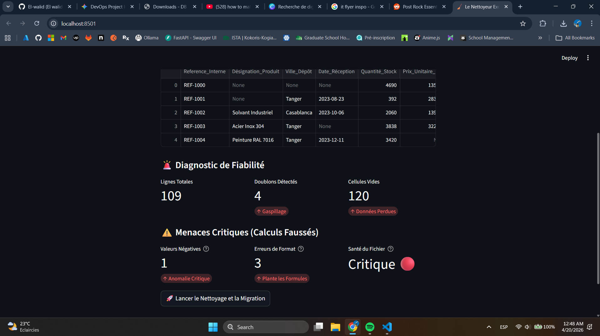

# 🧹 Le Nettoyeur: Enterprise Excel Sanitizer & SQL Migrator


## 📋 Executive Summary



**Le Nettoyeur** (The Sanitizer) is a B2B Data Engineering tool designed to bridge the gap between messy, human-managed Excel files and structured, cloud-ready databases. 

In many industrial sectors, critical supply chain data is plagued by human error: mixed data types (e.g., "150 units" in a math column), invisible characters, missing relationships, and "ghost records" with no identifiers. This application acts as an automated ETL (Extract, Transform, Load) pipeline that audits the data, surgically repairs anomalies using smart imputation, and locks the clean data into a secure SQLite database.

## 🏗️ Core Features

### 1. 🚨 Advanced Risk Audit (Phase 1)
Before altering any data, the system performs a deep health diagnostic to expose critical threats that break financial calculations:
* **Format Error Detection:** Identifies text strings hiding inside numerical columns.
* **Negative Anomaly Detection:** Flags impossible inventory metrics (e.g., negative prices or stock).
* **Overall Health Score:** Calculates a dynamic readiness score for the dataset.

### 2. 🧠 Smart Imputation & Ghost Busting (The Transformation)
Standard data cleaning just deletes bad rows. This engine *repairs* them:
* **Regex Extraction:** Automatically strips text from numbers (converts `"150 UNITS"` -> `150`) to ensure 100% mathematical purity.
* **Relational Auto-Fill:** Uses Pandas `groupby` logic to deduce missing suppliers or cities based on historical product data.
* **Ghost Record Isolation:** Instead of crashing the database, missing product names are explicitly flagged as `🚨 PRODUIT FANTÔME - À VÉRIFIER` so managers can audit their warehouse.
* **ID & Date Rescue:** Auto-generates recovery IDs for missing references and applies timestamp defaults.

### 3. 🗄️ Dual-Format Migration (Phase 2)
The cleaned pipeline outputs two assets:
* **For Humans:** A stylized `.xlsx` file generated via `openpyxl`, featuring dynamic column widths, professional MAD currency formatting, and automated color-coding for critical stock levels.
* **For Systems:** A robust `.db` (SQLite) relational database file, perfectly formatted and ready to be connected to Power BI or migrated to Microsoft Azure.

---

## 🚀 How to Run Locally

### Prerequisites
* Python 3.10+
* Virtual Environment (recommended)

### Installation
1. Clone the repository:
   ```bash
   git clone (https://github.com/El-walid/excel-data-sanitizer.git)
   cd excel-data-sanitizer
   ```
2. Create and activate a virtual environment:
   ```bash
   python3 -m venv venv
   source venv/bin/activate  # On Windows use: venv\Scripts\activate
   ```
3. Install dependencies:
   ```bash
   pip install -r requirements.txt
   ```
4. Run the Streamlit application:
   ```bash
   streamlit run app.py
   ```

### 🧪 Testing the Engine
This repository includes a `generate_hard_mode_data.py` script. Run this script to generate a chaotic, enterprise-level nightmare Excel file (`chaos_industriel.xlsx`) filled with format errors, missing data, and negative numbers. Upload this file to the Streamlit app to watch the ETL pipeline repair it in real-time.

---

## 👤 Author

**El Walid El Alaoui Fels**
* **Role:** Consultant in Data Engineering & Automation (pursuing an Engineering Degree)
* **Focus:** Cloud Data Platforms, ETL Pipelines, and Business Process Automation
* [LinkedIn](https://www.linkedin.com/in/el-walid-el-alaoui-fels-51491538b/)
* [Malt](https://www.malt.com/profile/elwalidelalaouifeks)